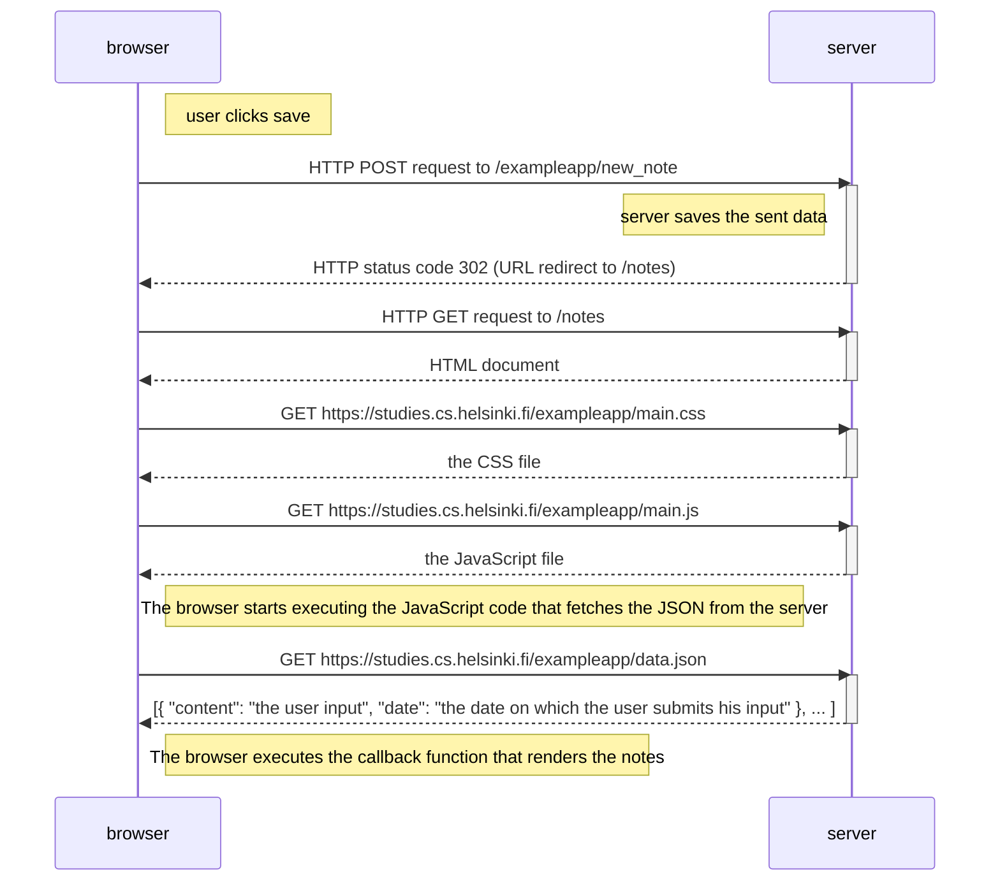

```mermaid
sequenceDiagram


    participant browser
    participant server

    Note right of browser: user clicks save
    browser->>server: HTTP POST request to /exampleapp/new_note
    activate server
    
    Note left of server: server saves the sent data
    server-->>browser: HTTP status code 302 (URL redirect to /notes)
    deactivate server

    browser->>server: HTTP GET request to /notes
    activate server
    server-->>browser: HTML document
    deactivate server

    browser->>server: GET https://studies.cs.helsinki.fi/exampleapp/main.css
    activate server
    server-->>browser: the CSS file
    deactivate server

    browser->>server: GET https://studies.cs.helsinki.fi/exampleapp/main.js
    activate server
    server-->>browser: the JavaScript file
    deactivate server

    Note right of browser: The browser starts executing the JavaScript code that fetches the JSON from the server

    browser->>server: GET https://studies.cs.helsinki.fi/exampleapp/data.json
    activate server
    server-->>browser: [{ "content": "the user input", "date": "the date on which the user submits his input" }, ... ]
    deactivate server

    Note right of browser: The browser executes the callback function that renders the notes
```
