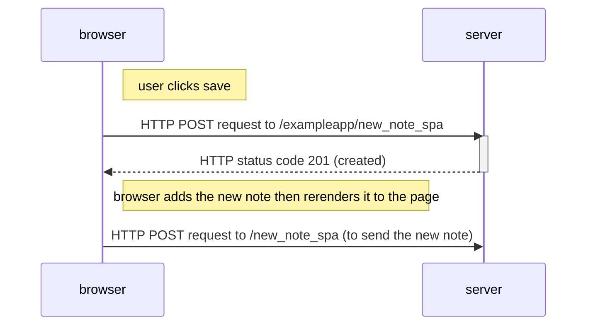

```mermaid
sequenceDiagram


    participant browser
    participant server

    Note right of browser: user clicks save
    browser->>server: HTTP POST request to /exampleapp/new_note_spa
    activate server
    
    
    server-->>browser: HTTP status code 201 (created)
    deactivate server
    
    Note right of browser: browser adds the new note then rerenders it to the page
    browser->>server: HTTP POST request to /new_note_spa (to send the new note)
    
```
